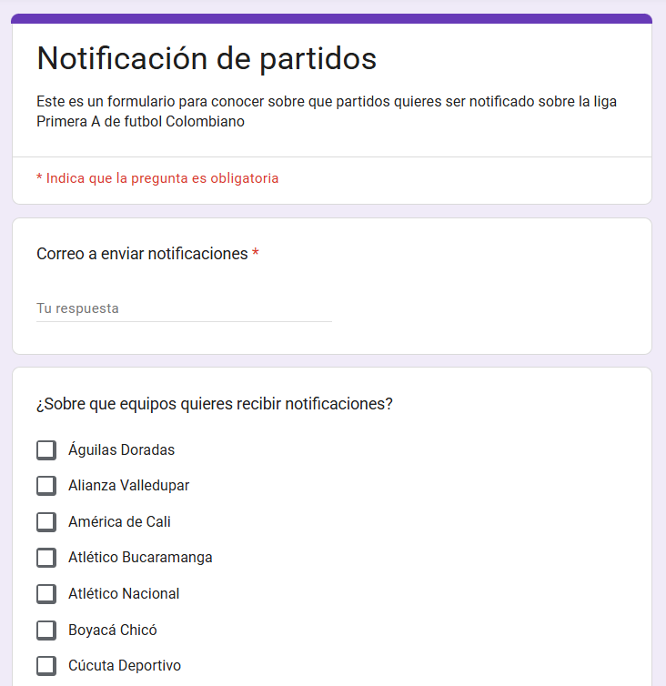
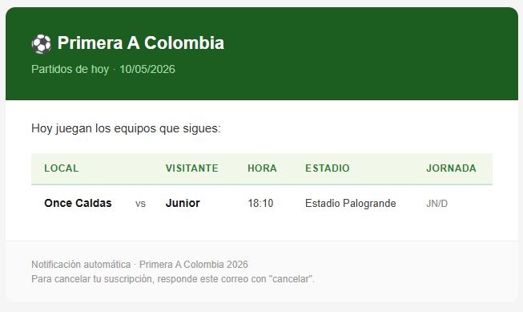

# Football-API · Notificaciones Primera A Colombia

Script en Python que cada día envía un correo a cada suscriptor con los partidos de Primera A en los que juegan los equipos que sigue.

> **¿Quieres recibir las notificaciones?** [Regístrate aquí](https://docs.google.com/forms/d/e/1FAIpQLSfWAvjTkm4juDIfujPEEUeR5ZGn3RQ488YpwjKwv8vfjYEv7A/viewform?usp=sharing&ouid=116755060793765765939) (Google Form).
>
> **Base de datos de suscriptores:** [Google Sheet](https://docs.google.com/spreadsheets/d/18N-jBqoiurxsd66mVli83SiTWUY58IgYh8Ov70ff8l0/edit?usp=sharing) — alimentada automáticamente por el Form.

## Demo

| Suscripción (Google Form) | Correo recibido |
|---|---|
|  |  |

## Requisitos

- Python 3.12+
- Cuenta Gmail con 2FA y [contraseña de aplicación](https://myaccount.google.com/apppasswords)

## Uso local

```bash
cp .env.example .env          # añadir GMAIL_USER y GMAIL_PASSWORD
pip install -r requirements.txt
python football_API.py
```

## Docker

```bash
docker build -t football-api .
docker run --rm --env-file .env football-api
```

## Tests

```bash
pip install -r requirements-dev.txt
pytest
```

---

Pensado para correr como **Cloud Run Job** disparado por **Cloud Scheduler** en Google Cloud, pero el contenedor es one-shot y corre igual de bien en local o en cualquier cron.
