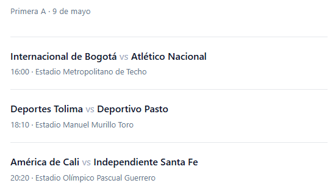

# Football-API · Notificaciones Primera A Colombia

Script en Python que cada día envía un correo a cada suscriptor con los partidos de Primera A en los que juegan los equipos que sigue.

> **¿Quieres recibir las notificaciones?** [Regístrate aquí](https://docs.google.com/forms/d/e/1FAIpQLSfWAvjTkm4juDIfujPEEUeR5ZGn3RQ488YpwjKwv8vfjYEv7A/viewform?usp=sharing&ouid=116755060793765765939) (Google Form).
>
> **Base de datos de suscriptores:** [Google Sheet](https://docs.google.com/spreadsheets/d/18N-jBqoiurxsd66mVli83SiTWUY58IgYh8Ov70ff8l0/edit?usp=sharing) — alimentada automáticamente por el Form.

## Demo

| Suscripción (Google Form) | Correo recibido |
|---|---|
|  |  |

## Características

- **Sin dependencias pesadas:** scraping con `requests` parseando el JSON que Next.js inyecta en el HTML — nada de Selenium, Playwright ni headless browsers.
- **Sin auth de Google:** el Sheet del Form se lee como CSV público vía `gviz/tq?tqx=out:csv`. Cero credenciales de GCP.
- **Multi-suscriptor:** cada usuario recibe únicamente los partidos de los equipos que marcó en el Form.
- **Tolerante a alias:** un diccionario `ALIAS` normaliza los nombres de equipos para reconciliar el texto del Form con el nombre canónico de onefootball.
- **Timezone-aware:** los kickoffs se convierten de UTC a `America/Bogota` antes de filtrar por "hoy".
- **Tests sin red:** toda la I/O (HTTP, SMTP) está mockeada con `pytest`.

## Cómo funciona

1. **Scrapea** la agenda de [onefootball.com](https://onefootball.com/es/competicion/primera-a-109/partidos) parseando el bloque `<script id="__NEXT_DATA__">`.
2. **Lee** los suscriptores desde un Google Sheet poblado por un Google Form (correo + equipos seguidos).
3. **Filtra** los partidos cuya fecha local (Bogotá) es hoy y enriquece cada uno con el estadio (segunda pasada al detalle).
4. **Cruza** equipos seguidos vs partidos del día y **envía** un correo HTML por SMTP de Gmail solo a quienes tengan match.

## Requisitos

- Python 3.12+
- Cuenta Gmail con 2FA y [contraseña de aplicación](https://myaccount.google.com/apppasswords)

## Variables de entorno

| Variable         | Requerida | Descripción                                                        |
| ---------------- | :-------: | ------------------------------------------------------------------ |
| `GMAIL_USER`     |     ✅    | Cuenta Gmail desde la que se envían los correos.                   |
| `GMAIL_PASSWORD` |     ✅    | App password de Gmail (no la contraseña normal de la cuenta).      |

Copiar `.env.example` a `.env` y completar los valores. El script falla con código distinto de cero si alguna falta.

## Uso local

```bash
cp .env.example .env          # añadir GMAIL_USER y GMAIL_PASSWORD
pip install -r requirements.txt
python football_API.py
```

## Docker

```bash
docker build -t football-api .
docker run --rm --env-file .env football-api
```

> `--env-file .env` es obligatorio: `.env` está en `.dockerignore` para que los secretos no entren a la imagen, así que se inyectan en runtime.

## Tests

```bash
pip install -r requirements-dev.txt
pytest
```

---

Pensado para correr como **Cloud Run Job** disparado por **Cloud Scheduler** en Google Cloud, pero el contenedor es one-shot y corre igual de bien en local o en cualquier cron.
